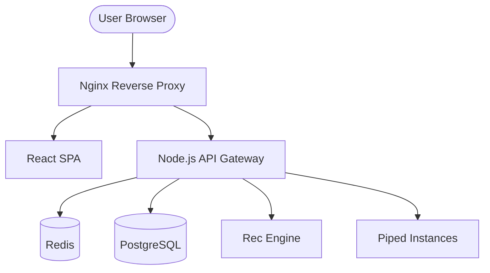

# 📺 YouTube Platform - Production-Grade Streaming Ecosystem

[](./docs/security/SSDLC.md)
[](./LICENSE)
[](./docs/MAINTENANCE.md)

A high-performance, secure, and resilient streaming platform architected for maximum survivability and scalability. This system abstracts public Piped infrastructure behind a hardened backend gateway, providing a seamless and private YouTube experience.

---

## 🏗️ System Architecture

The platform follows a **Gateway-based Monorepo** architecture, isolating the frontend from the volatility of external providers.



### 🚀 Tech Stack
- **Frontend**: React 18 (TypeScript), Tailwind CSS, Shaka Player, Redux Toolkit, Framer Motion.
- **Backend**: Node.js (Express), Zod (Validation), Argon2id (Auth), Winston (Logging).
- **Data**: PostgreSQL 15 (Persistence), Redis 7 (Caching).
- **Infrastructure**: Docker, Nginx, GitHub Actions (CI/CD).

---

## 🛡️ Core Capabilities & Modules

| Module | Description | Location |
|---|---|---|
| **API Gateway** | Hardened entry point with JWT rotation, rate-limiting, and XSS/SSRF protection. | `/backend` |
| **Instance Manager** | Dynamic failover & health scoring for public Piped nodes. | `/backend/src/instance-manager` |
| **Playback Engine** | Shaka-powered persistent player with MediaSession API & HLS/Dash support. | `/frontend/src/player` |
| **Rec Engine** | Weighted scoring algorithm for personalized & discovery feeds. | `/recommendation-engine` |
| **Secure Logic** | Strict Zod schemas, whitelisted request layer, and sanitized outputs. | `/backend/src/security` |
| **Observability** | Structured JSON logging, real-time telemetry, and health probes. | `/backend/src/monitoring` |

---

## 💎 Key Production Pillars

### 1. High Survivability
The **Instance Manager** proactively monitors the health of upstream Piped nodes. If a node fails, it is automatically blacklisted, and traffic is routed to the next most stable instance, ensuring zero downtime for end-users.

### 2. Provider Abstraction
The backend implements a `VideoProviderInterface`. This architecture ensures the platform can swap or aggregate data sources (Invidious, NewPipe, etc.) without a single change to the frontend codebase.

### 3. Secure by Design (SSDLC)
- **Zero-Trust Networking**: Isolated Docker networks for data and application layers.
- **Identity Protection**: Argon2id hashing and sliding-window JWT refresh rotation.
- **Data Integrity**: 100% API coverage with Zod schema validation.

### 4. Performance Optimized
- **Tiered Caching**: Intelligent Redis expiration for Trending (30m), Home (10m), and Metadata (24h).
- **Frontend Efficiency**: Route-level code splitting, asset lazy loading, and request deduplication.

---

## 🚦 Getting Started

### Prerequisites
- **Docker & Docker Compose** (Required for production deployment)
- **Node.js v18+** (For local development)
- **PostgreSQL 15 & Redis 7**

### Quick Start (Local Development)
1. **Clone & Setup**:
   ```bash
   git clone <repo-url>
   cp .env.example .env
   # Edit .env with your secrets
   ```
2. **Install Dependencies**:
   ```bash
   npm install && cd backend && npm install && cd ../frontend && npm install
   ```
3. **Run Dev Environment**:
   ```bash
   # Root directory
   docker-compose up -d  # Starts DB & Redis
   cd backend && npm run dev
   cd frontend && npm run dev
   ```

---

## ⚙️ Operations & Monitoring

### Health Checks
- **Gateway Health**: `GET /api/v1/health/health`
- **System Readiness**: `GET /api/v1/health/ready` (Checks DB/Redis)

### Monitoring & Logs
The system uses standardized JSON logging. In production, logs are accessible via:
```bash
docker logs yt_backend --tail 100 -f
```

---

## 📚 Documentation Index

| Category | Documents |
|---|---|
| **High Level** | [Architectural Synthesis](./docs/FINAL_SYNTHESIS.md) \| [Release Checklist](./docs/release/RELEASE_CHECKLIST.md) |
| **Architecture** | [Instance Manager](./docs/architecture/INSTANCE_MANAGER.md) \| [Rec Engine](./docs/architecture/RECOMMENDATION_SYSTEM.md) |
| **Security** | [SSDLC Policy](./docs/security/SSDLC.md) \| [Threat Model](./docs/security/THREAT_MODEL.md) |
| **Infrastructure** | [Network/Docker](./docs/infrastructure/ARCHITECTURE.md) \| [DevOps Pipeline](./docs/devops/PIPELINE.md) |
| **Operational** | [Monitoring Guide](./docs/operations/MONITORING.md) \| [Maintenance](./docs/MAINTENANCE.md) |

---

## 🤝 Contributing & Standards

We follow strict production standards:
- **Branching**: `feature/*` -> `develop` -> `main`.
- **Commits**: [Conventional Commits](https://www.conventionalcommits.org/).
- **Linting**: ESLint + Prettier required.

See [CONTRIBUTING.md](./CONTRIBUTING.md) for detailed guidelines.

---

**Developed for high-scale, private streaming.**
*Delivered by Gemini CLI - Final Production Release Phase.*
